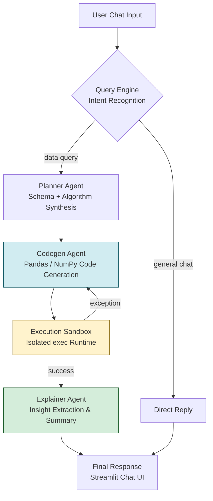

<div align="center">

# AI Data Analyst Agent
### Autonomous Multi-Agent System for Natural Language Data Analysis


</div>

---

## Overview

**AI Data Analyst Agent** is a production-style autonomous data science application that replaces manual Pandas scripting with natural language interaction. Users upload a structured dataset (CSV/XLSX) and converse with a 5-node **LangGraph** multi-agent system that plans, writes, executes, and self-corrects Python analysis code in real time — then explains the results in plain English.

The system was designed to demonstrate **end-to-end agentic engineering**: intent routing, plan synthesis, sandboxed code execution, automatic error recovery, and secure multi-user session handling — all deployed behind a live Streamlit interface.

**Live Demo:** *[add deployment link]*
**Repo:** [github.com/amulyagavankar20-glitch/Data-Analyst-Ai](https://github.com/amulyagavankar20-glitch/Data-Analyst-Ai)

---

## Key Highlights (Resume-Ready)

- Architected a **5-node LangGraph agent pipeline** (Query → Planner → Codegen → Executor → Explainer) that autonomously translates natural language into executable data analysis code, replacing manual EDA workflows.
- Implemented a **self-healing execution sandbox** that intercepts runtime exceptions during isolated `exec()` calls and routes them back to the Coder agent for automatic debugging, cutting failed-query rate through up to 3 auto-retry cycles.
- Built **automated EDA validation** that runs on every file upload — detecting schema anomalies, missing values, and duplicate records without user intervention.
- Integrated **Firebase REST authentication** with session-persistent state management across Streamlit reruns, enabling secure multi-user access.
- Engineered dynamic **Matplotlib/Seaborn visualization generation**, where chart code is authored entirely by the LLM and streamed directly to the frontend.
- Deployed the full stack via **Docker**, with environment-based secrets management for API credentials.

---

## System Architecture

A finite state machine (`src/agents/graph.py`) governs agent routing and self-correction:



*Self-correction loop: on runtime exception, the sandbox routes the error back to the Codegen agent for automatic debugging (up to 3 retries) before falling through to the Explainer.*

### Agent Responsibilities

| Node | Function | Core Responsibility |
|---|---|---|
| **Query Engine** | `query_node` | Classifies user intent — routes between general chat and data-analysis queries |
| **Planner Agent** | `planner_node` | Synthesizes dataset schema (dtypes, distributions) into a concrete multi-step execution plan |
| **Codegen Agent** | `codegen_node` | Translates the plan into syntactically verified Pandas/NumPy code |
| **Execution Sandbox** | `executor_node` | Runs generated code in an isolated `exec()` context; captures stdout, state mutations, and exceptions |
| **Explainer Agent** | `explainer_node` | Converts raw execution output into a human-readable analytical summary |

---

## Core Features

- **Multi-Agent Orchestration:** Custom LangGraph state machine coordinating 5 specialized agents to solve multi-step analytical reasoning tasks that a single LLM call cannot reliably handle.
- **Self-Healing Code Execution:** Runtime exceptions inside the sandbox are caught and fed back into the Coder agent with error context, enabling automatic debugging and code rewriting (up to 3 retries) without user intervention.
- **Automated Data Validation:** Every uploaded dataset is immediately profiled for schema anomalies, missing values, and duplicate records before any query is run.
- **Dynamic Visualization:** Matplotlib/Seaborn charts are generated on-the-fly by LLM-authored code and rendered directly in the chat interface — no predefined chart templates.
- **Secure Session Management:** Firebase REST API handles authentication and preserves session state across Streamlit reruns, supporting concurrent multi-user access.

---

## Tech Stack

| Layer | Technology |
|---|---|
| Frontend | Streamlit (custom CSS) |
| Agent Orchestration | LangChain, LangGraph |
| LLM Inference | Groq Cloud — `llama-3.1-8b-instant` |
| Data Processing | Pandas, NumPy |
| Visualization | Matplotlib, Seaborn |
| Auth & Session | Firebase Admin / REST API |
| Deployment | Docker |

---

## Repository Structure

```
Data-Analyst-Ai/
├── app.py                     # Streamlit UI and application loop
├── Dockerfile                 # Containerization spec
├── requirements.txt           # Dependencies
└── src/
    ├── auth.py                # Firebase authentication handlers
    └── agents/
        ├── graph.py            # LangGraph FSM definitions
        └── utils.py            # Agent state class & utilities
```

---

## Setup & Installation

### Prerequisites
- **Groq API key** — [console.groq.com](https://console.groq.com/)
- **Firebase Web API key** — for authentication

### Steps

```bash
# 1. Clone the repository
git clone https://github.com/amulyagavankar20-glitch/Data-Analyst-Ai.git
cd Data-Analyst-Ai

# 2. Create a virtual environment
python -m venv venv
source venv/bin/activate   # On Windows: venv\Scripts\activate

# 3. Install dependencies
pip install -r requirements.txt

# 4. Configure environment variables (.env)
echo "GROQ_API_KEY=your_groq_api_key_here" >> .env
echo "FIREBASE_API_KEY=your_firebase_api_key_here" >> .env

# 5. Run the app
streamlit run app.py
```

### Docker

```bash
docker build -t ai-data-analyst .
docker run -p 8501:8501 --env-file .env ai-data-analyst
```

---

## Usage

1. **Sign in** via the Firebase-authenticated login screen.
2. **Upload** a `.csv` or `.xlsx` file — the system runs automated EDA and schema validation instantly.
3. **Ask questions** in natural language, e.g.:
   - *"Remove empty rows and drop duplicates."*
   - *"Plot the correlation between Age and Salary."*
   - *"What's the average transaction value by region?"*
4. **Inspect agent reasoning** by expanding "View Analysis Steps" to see the generated plan, code, and execution trace.

---

## Roadmap

- [ ] Add support for SQL-backed datasets (Postgres/BigQuery connectors)
- [ ] Multi-file / multi-table join reasoning
- [ ] Persistent conversation memory across sessions
- [ ] Evaluation harness for code-generation accuracy benchmarking

---

## License

MIT
